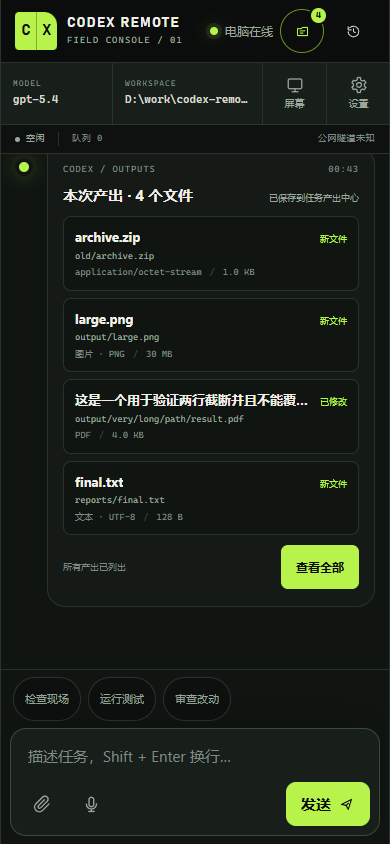
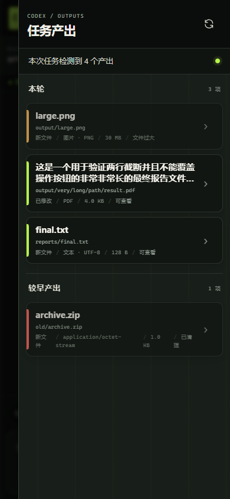
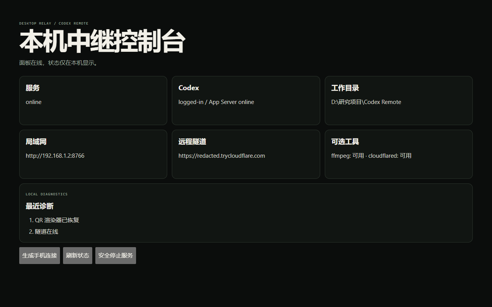

# 📱 手机遥控 Codex · Phone Remote for Codex

> 在手机上继续电脑里的 Codex 任务：看实时输出、处理逐项批准、恢复线程、查看本轮生成文件，并在需要时查看和控制 Windows 屏幕。


<p align="center">
  
</p>

Codex Remote 是运行在你自己 Windows 电脑上的移动控制台。它连接本机官方 Codex CLI，不复制登录凭据，也不要求额外的 API key。手机端是一套为触控优化的 PWA：同一 Wi-Fi 可以直接扫描二维码，外出时可以通过可选的 Cloudflare 隧道连接。

与普通“终端网页”不同，它理解 Codex 的线程、回合、工具活动与批准请求；任务结束后，还会把期间检测到的新建或修改文件整理成可在手机上查看的**任务产出中心**。

## 🌍 English

Codex Remote is a self-hosted, mobile-first remote console for the local OpenAI Codex CLI. Authentication and workspaces stay on your Windows PC; a token-protected PWA lets your phone continue tasks without copying Codex credentials.

- Send prompts and follow streaming responses and tool activity.
- Allow or reject command, file, network, permission, and user-input requests.
- Resume local Codex threads after phone or network reconnection.
- Discover task-time output files and preview supported text, image, and PDF content.
- View the Windows screen and use guarded touch, keyboard, and shortcut controls.
- Connect over LAN, an optional Cloudflare Quick Tunnel, or a self-hosted rendezvous Worker.

## ✨ 核心能力

- **手机继续任务**：发文字、传图片、查看实时输出，不必一直守在电脑前。
- **逐项批准**：命令、文件修改、网络、额外权限和用户输入均显示独立批准卡片；默认不自动放行。
- **线程恢复**：读取、切换和续接本机 Codex 线程，断线后恢复已记录的任务上下文。
- **任务产出中心**：每轮结束后整理任务期间检测到的新建或修改文件，支持历史回看、固定和下载。
- **安全预览**：栅格图片、严格文本和 PDF 可以内联查看；未知、主动内容和冲突格式强制下载。
- **屏幕与触控**：查看 Windows 画面，并在可信设备上执行点击、文本、组合键和手势。
- **局域网与公网**：同一 Wi-Fi 直接连接；需要外网时可启用 Quick Tunnel 和可选中转 Worker。
- **像 App 一样使用**：Android、iPhone、iPad 和 HarmonyOS 均可安装 PWA；Android 另有自用 Debug APK 构建。

## 📸 界面预览

以下截图来自自动化 QA 固定场景，不包含真实账号、token、二维码、私人提示或工作文件。

<table>
  <tr>
    <td width="50%" align="center">
      <br />
      <strong>移动任务控制台</strong><br />流式任务、连接状态和本轮产出集中在一屏。
    </td>
    <td width="50%" align="center">
      <br />
      <strong>任务产出中心</strong><br />按本轮与较早产出分组，展示预览与下载策略。
    </td>
  </tr>
</table>

<p align="center">
  
  <br /><strong>本机中继控制台</strong>：连接信息和诊断只在电脑本机显示。
</p>

## 🖥️ 五分钟开始

### 运行要求

- Windows 10 或 Windows 11
- Node.js 18 或更高版本，建议当前 LTS
- 同一 Windows 用户下已完成 Codex 登录
- 可选：可信的 `cloudflared.exe`，用于公网 Quick Tunnel
- 可选但建议：可信的 Windows 版 `ffmpeg.exe`，用于稳定全屏截图

在独立仓库根目录打开 PowerShell：

```powershell
npx --yes --package @openai/codex@0.144.1 codex login
npx --yes --package @openai/codex@0.144.1 codex login status
.\start.bat
```

登录成功后，`start.bat` 会把仓库当作只读安装介质，根据内容哈希在 `%LOCALAPPDATA%\CodexRemote\runtime\<内容哈希>` 原子准备运行时，并把 npm 缓存放到 `%LOCALAPPDATA%\CodexRemote\npm-cache`。它不会在仓库里创建 `config.json` 或 `node_modules`。

首次启动会在 `%LOCALAPPDATA%\CodexRemote\config.json` 生成本机专用的随机访问 token，默认端口为 `8766`。如果二维码渲染失败，服务仍会继续运行，本机控制台会保留可复制的连接入口。

`ffmpeg.exe` 和 `cloudflared.exe` 只从独立仓库根目录或系统 `PATH` 查找，不依赖相邻遥控项目或任何父目录文件。

## 📲 手机连接与安装

1. 手机与电脑在同一局域网时，扫描启动窗口或本机面板显示的局域网二维码。
2. Quick Tunnel 就绪后，也可以扫描 HTTPS 隧道二维码。
3. 页面保存连接后会清理地址栏中的访问参数；仍不要转发原始二维码或连接链接。
4. Android Chrome 选择“安装应用”或“添加到主屏幕”。
5. iPhone / iPad 使用 Safari 分享菜单中的“添加到主屏幕”。
6. 首次发送任务前确认工作目录；工具请求会显示批准面板。

完整图文流程见 [使用教程](./docs/使用教程.md)。

## 📦 任务产出与批准

每轮任务完成后，“本次产出”卡片会显示任务期间检测到的新建或修改文件，历史产出抽屉可以重新打开记录。因为同一工作区可能同时被编辑器或其他程序写入，界面只陈述“任务期间检测到”，不会把所有变化断言为 Codex 独占创建。

确认后的文件会复制到 `%LOCALAPPDATA%\CodexRemote\artifacts` 中的不可变本机副本，原文件以后发生变化不会改写历史记录。默认上限为：

- 单文件 256 MiB
- 单轮 1 GiB
- 本机产出库 2 GiB

栅格图片、严格文本和 PDF 可以安全内联预览；ZIP、HTML、可执行内容、未知格式以及扩展名与文件签名冲突的内容只允许下载。预览与下载使用 60 秒、用途绑定的短时票据，不会在文件 URL 中携带长期控制 token。

默认逐项批准命令、文件修改、网络、额外权限和用户输入。一次批准只处理当前请求。“会话自动批准”只存在于当前后端进程，且只覆盖后端明确判定为合格的低风险读取请求；关闭或重启服务后一定恢复为关闭状态。

## 🌐 局域网、公网隧道与中转

默认会尝试启动 Cloudflare Quick Tunnel，隧道域名可能随重启变化。把可信的 `cloudflared.exe` 放到仓库根目录，或确保 `cloudflared` 位于系统 `PATH`。

只使用局域网时：

```powershell
$env:NO_TUNNEL="1"
.\start.bat
```

需要固定手机入口时，可以部署 [Cloudflare Worker 中转](./docs/远程连接与中转.md)。中转只保存当前隧道的基础 URL，不保存手机 token、Codex 登录信息、提示或聊天记录；它不是代理，也不是凭据保险箱。

## 👀 屏幕查看与触控

将可信来源的 Windows 版 `ffmpeg.exe` 放入仓库根目录后重启服务。服务优先使用 `ffmpeg` 的 `gdigrab`，失败时才调用 PowerShell 截图后备。DPI 感知脚本会把手机坐标换算为物理像素，并逐次执行点击、文本、组合键和手势。

屏幕抓取和输入模拟可能与游戏反作弊系统冲突。不要尝试规避检测；运行相关游戏前先停止 Codex Remote、取消开机自启并重启电脑。

## 🔒 安全边界

- 官方 Codex CLI 始终负责登录和认证；Codex Remote 不复制或上传认证文件。
- 二维码、原始连接链接和 `%LOCALAPPDATA%\CodexRemote\config.json` 都应视为敏感信息。
- 本机控制面板使用独立、仅内存保存的 capability，不复用手机 token。
- 配置、运行状态、依赖、日志、二维码、签名证书、APK 和可执行文件均被发布检查阻止进入仓库。
- 不要把端口直接裸露到公网，只在自己的 Windows 会话、可信手机与可信网络中运行。
- 不使用时按 `Ctrl+C`，或双击 [停止遥控.bat](./停止遥控.bat) 安全停止本服务拥有的进程树。

私下报告安全问题请阅读 [SECURITY.md](./SECURITY.md)。

### 停止与移除

日常停止可在启动窗口按 `Ctrl+C`，或双击 [停止遥控.bat](./停止遥控.bat)。停止脚本只定位本启动器拥有的服务进程树，不会按名称结束其他 Node 或 Codex 应用。

移除 Codex Remote 时，先停止服务，再删除本仓库和 `%LOCALAPPDATA%\CodexRemote`。不要删除你的工作区、`%USERPROFILE%\.codex` 或 Codex 登录数据。若只想清理历史任务产出，停止服务后删除 `%LOCALAPPDATA%\CodexRemote\artifacts` 即可。

## 📱 Android、iPhone / iPad 与 HarmonyOS

- **Android**：GitHub Actions 中的 `Build Codex Remote APK` 生成自用 Debug APK。它不是经过商店发布签名的正式安装包；见 [移动端构建](./docs/移动端构建.md) 和 [Android 壳说明](./app-android/README.md)。
- **iPhone / iPad**：通过 HTTPS 在 Safari 打开并添加到主屏幕。本项目不创建 Xcode 工程，也不提供原生 iOS 安装包。
- **HarmonyOS NEXT**：在 DevEco Studio 新建工程，同步 ArkTS 壳与 Web 资源，再用自己的证书手工签名；仓库不包含证书。见 [HarmonyOS NEXT 教程](./app-harmony/使用教程-鸿蒙NEXT.md)。

三种平台共享同一套只读任务产出协议。修改 `public/` 后必须重新同步 Android 和 HarmonyOS 资源，尤其不能遗漏本地 PDF worker。

## ⚙️ 配置与 Windows 脚本

首次启动后，仓库外的 `%LOCALAPPDATA%\CodexRemote\config.json` 会保存 `port`、访问 token、`cwd`、模型、推理强度和可选中转配置。不要提交、截图或分享它。

可用环境变量仅覆盖当前进程：`CODEX_REMOTE_PORT`、`CODEX_REMOTE_TOKEN`、`CODEX_CWD`、`CODEX_MODEL`、`CODEX_EFFORT`、`CODEX_REMOTE_RENDEZVOUS_URL`、`CODEX_REMOTE_RENDEZVOUS_SECRET` 和 `CODEX_REMOTE_DEVICE_ID`。

| 脚本 | 用途 |
|---|---|
| [start.bat](./start.bat) | 检查环境，通过用户本地内容哈希运行时安装依赖并启动。 |
| [创建桌面图标.bat](./创建桌面图标.bat) | 创建当前用户桌面快捷方式。 |
| [设置开机自启.bat](./设置开机自启.bat) | 创建独立的 `CodexRemote.lnk`。 |
| [取消开机自启.bat](./取消开机自启.bat) | 只删除上述 Codex Remote 快捷方式。 |
| [停止遥控.bat](./停止遥控.bat) | 停止本启动器拥有的服务进程树。 |
| [创建Git备份.bat](./创建Git备份.bat) | 为干净、已提交的仓库创建可恢复 Git Bundle。 |

## 🧩 项目结构

```text
codex-remote/
├─ server.js                 组合入口与安全关闭
├─ src/                      App Server、批准、线程、产出、隧道和 Windows 封装
├─ public/                   手机 PWA 与本机控制台
├─ scripts/                  启动、备份、截图、输入和发布验证
├─ cloudflare-worker/        可选中转 Worker
├─ app-android/              Capacitor Debug APK 包装
├─ app-harmony/              HarmonyOS NEXT ArkTS 壳
├─ docs/                     使用、连接、构建、发布与备份文档
├─ .github/workflows/        Windows 验证与 Debug APK 构建
└─ test/                     单元、协议、集成、视觉和文档合同
```

## ❓ 故障排查

| 现象 | 处理 |
|---|---|
| Node.js 未找到或版本过低 | 安装 Node.js 18+，重开终端后运行 `node --version`。 |
| Codex 显示未登录 | 在同一 Windows 用户下重新运行固定版本登录命令和 `codex login status`。 |
| 依赖安装失败 | 检查网络、代理和系统盘空间；缓存位于用户本地目录，无需管理员权限。 |
| 手机打不开局域网地址 | 确认同一 Wi-Fi、Windows 防火墙允许 Node、端口 `8766` 未被占用。 |
| 二维码没有显示 | 服务仍会启动；从本机控制台复制连接入口。 |
| 隧道一直离线 | 检查 `cloudflared` 与网络；设置 `NO_TUNNEL=1` 先验证局域网。 |
| 手机上看不到任务文件 | 打开当前任务的“本次产出”或历史产出抽屉；重连后元数据会恢复。 |
| 截图黑屏、裁切或点击偏移 | 安装可信 `ffmpeg.exe` 并重启服务，不要通过降低显示缩放掩盖问题。 |
| PWA 仍是旧界面 | 完全关闭页面后重开，必要时在浏览器站点设置中清除缓存。 |
| 批准卡片没有消失 | 刷新当前回合；重启会拒绝未完成请求并关闭会话自动批准。 |

## 💾 GitHub 发布与备份

Codex Remote 应发布为独立的 `codex-remote` 仓库，不要把它推送到其他项目的远端。

完整步骤见 [GitHub 发布与备份](./docs/GitHub发布与备份.md)。已经提交完本地修改后，也可以双击 [创建Git备份.bat](./创建Git备份.bat) 生成可恢复的完整 Git Bundle。

发布前开发者应在可写工作副本中运行：

```powershell
npm ci --no-audit --no-fund
npm run verify
npm run release:verify
npm run release:copy
```

自动化覆盖协议、批准、断线恢复、任务产出、安全策略、发布副本和多视口 UI；实体手机扫码、触摸与真实第二设备重连仍建议由发布者在自己的网络环境中完成最终人工验收。

## 📜 开源与贡献

- 贡献要求：[CONTRIBUTING.md](./CONTRIBUTING.md)
- 私下报告漏洞：[SECURITY.md](./SECURITY.md)
- MIT 许可证：[LICENSE](./LICENSE)
- 版本变化：[CHANGELOG.md](./CHANGELOG.md)
- 第三方许可：[THIRD_PARTY_NOTICES.md](./THIRD_PARTY_NOTICES.md)
- 发布检查：[发布检查清单](./docs/发布检查清单.md)

技术栈：Node.js · Express · WebSocket · OpenAI Codex App Server · PWA · Cloudflare Tunnel / Workers · Capacitor · HarmonyOS ArkTS · PowerShell · ffmpeg。
